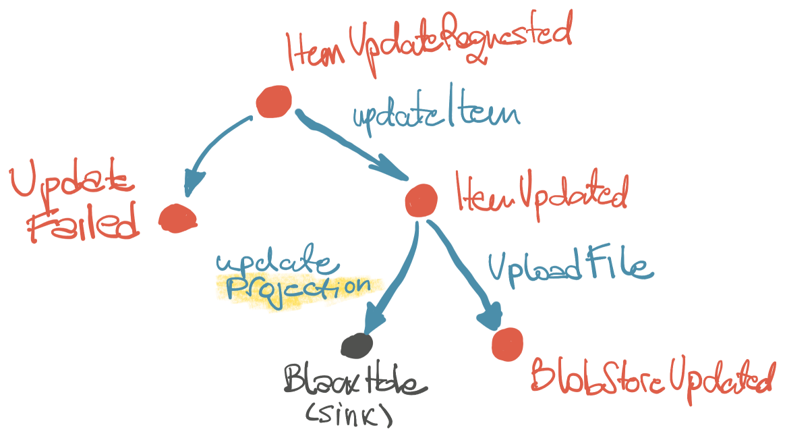

# **`Ether`** ♒️ & **`Matter`** ⚛️

Welcome to Event Drive thought experiment ended up as a small engine.

⚠️ This is `Either<Stupid, Great>`, still can't figure. Built in 3 days time.

Frankly, there is nothing new here; but I didn't see this exact combination of ideas in the wild. 🤷‍♂️

## Pipes 🌊

```
Pipe == Input -> UnitOfWork -> Output
```

⭐️ Every app in the nutshell is a event-driven app. The **unit of work** (UOW) is just a function of a _single_ input, producing a _single_ output. We can connect UOWs by their input/output types, like... pipes. Hence we refer the UOW as a **pipe**.

⭐️ A **pipe** is a function that takes an _input_ and produces an _output_. It represents a **unit of work**. Pipes can be connected to each other, forming a mesh.

Pipe receives _only_ a `Event`. Pipe produces _only_ a `Event`. Events are connections between pipes. Is a pipe a _event handler_? Possibly. Is a pipe a _command_? Possibly.

We may say that the application is a mesh of pipes, connected together. Here is a beautiful schema that illustrates the idea:



Example of a pipe:

```kt
val createToDoList = Pipe<ToDoListCreateRequested> {
    val list = Store.createNewDraftToDoList(it.listId)
    ToDoListCreated(list.id)
}
```

## Ether ♒

```
Ether == mesh of Pipes
```

⭐️ `Ether` is a glorious name for the Event bus engine abstraction that connects pipes and runs events on it. It is a very simple abstraction, that can be implemented in various ways. In this case, it is implemented with [NATS](https://nats.io/).

Event may be fired (and forget):

```kt
ether.emit(ToDoListCreateRequested(id))
```

This will trigger the execution of all pipes connected somehow to the initial event. The execution is asynchronous and non-blocking to the calling place.

Event may be fired with a in-place listener:

```kt
ether.emit(ToDoListSaveRequested(listId, name)) { event, finish ->
    if (event is ToDoListSaved) {
        UIOperations.success(operationId, event)
        finish()
    } else if (event is ToDoListNotSaved) {
        UIOperations.failure(operationId, event)
        finish()
    }
}
```

Cool thing here is that provided lambda ONLY listens to events in the context of the current execution. It is NOT a global listener. Again, ONLY events that are created by pipes executed during this operation will be handled. This is cool when we want to have a listener that is only active during the current operation (non-blocking request/response)

## Events ⚡️

```
Event == Input, Output, Fact
```

⭐️ Events belong to a **Realm**. Realm is a simple name that represents a boundary.

⭐️ Events are executed one after the another, in the single-threaded fashion, _within the same boundary_. This is important, as it allows us to have a consistent state of the application.

⭐️ `BlackHole` is a sink event. It is a special event that is not emitted by any pipe. It is used to terminate the event flow. It is like a `null` in the event world.

Pipes that are updating _projections_ are the ones that usually returns the `BlackHole` event.

🤔 You realized by now that `Pipe` can be actually any serializable data object, right?

## Matter ⚛️

```
Pipe = Pure + Matter
```

We can go further with abstractions and remove explicit state handling from the `Pipe` functions. This is where the `Matter` comes in. It is a simple interface that knows how to:

+ load state from the storage for given (input) event
+ save state to the storage for given (resulting) event

This allows us to extract state handling and have **pure functions** that are only concerned with the business logic.

⭐️ `Matter` implementation is done by user:

```kt
class StoreMatter : Matter {
    override fun <S> loadState(event: Event): S {
        return when (event) {
            is ToDoListSaveRequested -> {
                SaveToDoListState(...)
            }
		}
    }

    override fun <SIN> saveState(state: SIN, event: Event) {
        when (event) {
            is ToDoListSaved -> {
                // save state
			}
        }
    }
}
```

Notice the `SaveToDoListState` - simple data class that holds the necessary input state for the business logic.

⭐️ Our `Pipe` may be designed now as a `Pure`:

```kt
val saveToDoList = Pure<ToDoListSaveRequested, SaveToDoListState> { _, it ->
    if (it.draftToDoList == null) {
        return@Pure ToDoListNotSaved("Draft list not found")
    }
    val newTodoList = ToDoList(it.draftToDoList.id, it.name)
    ToDoListSaved(newTodoList)
}
```

It is a pure function! Is it a `decider`/`evolver`? Possibly.

`Pure` function is transformed into a `Pipe` by the... well, `Piper`:

```kt
Piper(matter)(saveToDoList)
```

⭐️ `Matter` may be implemented in various ways:

+ transactional, traditional database
+ in-memory, for testing
+ event-sourced, for the event-sourced systems

## Infrastructure ⚙️

```
Instrastructure == Implementation
```

⭐️ The big idea here is that infrastructure is an implementation detail.

⭐️ [NATS](https://nats.io) cluster with JetStream - used as the _implementation_ of the `Ether` in the example. `Ether` itself has very simple interface (abstraction) that could be easily replaced with another event engine. Moreover, we can have an in-memory implementation for local development and testing.

With Nats, pipes can be deployed anywhere. There is also an option that I didn't have time to explore for horizontal scaling of the pipes (using Nats groups).

⚠️ I haven't spent much time on the infrastructure part, so it is a bit rough, maybe not working as expected.

⭐️ [VertX](https://vertx.io/) for the API layer - because of its async nature, VertX seem as an excellent choice for the API layer.


## Example 🎉

This very simple example illustrates the idea.

+ REST endpoint that triggers the creation of the ToDo list (async)
+ Operation tracker that returns the status of the operation (async)
+ Connected pipes
+ Update of the projection
+ In-Place handler
+ Distributed pipes

The storage atm is just a simple in-memory map.

Check out the `http` folder.

## Should I stay or should I go? 🚶‍♂️‍➡️

I _feel_ potential in this engine, but I am just tired and can not think straight 🤷‍♂️ Let me know. There is so many things that can be done here...

+ If this make sense, I would like to thank: [Dejan](https://github.com/DejanMilicic), [Ivan](https://fraktalio.com). They know way more than me about this stuff.
+ If this is stupid, that's on me only :)
